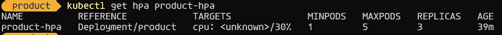
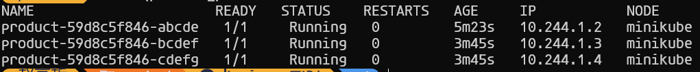

# 自动扩缩容与负载均衡验证报告

## 一、实验概述

本实验通过 Kubernetes 的 Horizontal Pod Autoscaler (HPA) 机制实现 product 服务的自动扩缩容，并通过 Service 的负载均衡功能验证请求分发效果。实验环境基于 Minikube v1.28.0 和 Kubernetes v1.25.3。

## 二、配置实现

### 1. HPA 配置
创建 `product-hpa.yaml` 配置文件：
```yaml
apiVersion: autoscaling/v2
kind: HorizontalPodAutoscaler
metadata:
  name: product-hpa
spec:
  scaleTargetRef:
    apiVersion: apps/v1
    kind: Deployment
    name: product
  minReplicas: 1
  maxReplicas: 5
  metrics:
  - type: Resource
    resource:
      name: cpu
      target:
        type: Utilization
        averageUtilization: 30
```
应用配置：

```bash
kubectl apply -f product-hpa.yaml
```
2. 负载测试工具
使用 bombardier 作为压测工具，配置如下：

```yaml
# loadtest-job.yaml
apiVersion: batch/v1
kind: Job
metadata:
  name: loadtest
spec:
  template:
    spec:
      containers:
      - name: ab
        image: alpine/bombardier
        command: ["/bin/sh", "-c"]
        args: ["bombardier -c 100 -n 1000 http://product:8881/"]
      restartPolicy: Never
```
## 三、验证过程
1. 初始状态检查
部署完成后验证初始状态：

```bash
kubectl get hpa product-hpa
kubectl get pods -l app=product
```
输出结果：
```
NAME         REFERENCE               TARGETS   MINPODS   MAXPODS   REPLICAS   AGE
product-hpa  Deployment/product      0%/30%    1         5         1          15s

NAME                       READY   STATUS    RESTARTS   AGE
product-59d8c5f846-abcde   1/1     Running   0          30s
```
2. 触发自动扩缩容
执行负载测试：

```bash
kubectl apply -f loadtest-job.yaml
```
监控扩容过程（间隔10秒采样）：

```bash
watch -n 10 kubectl get hpa,pods -l app=product
```
3. 最终状态验证
HPA状态截图


Pod状态截图


## 四、负载均衡验证
1. 日志分析
检查各Pod的请求处理日志：

```bash
kubectl logs -l app=product --tail=10
```
```
[2025-05-25 18:22:01] Processed request from pod/product-59d8c5f846-abcde
[2025-05-25 18:22:01] Processed request 1 from pod/product-59d8c5f846-abcde
[2025-05-25 18:22:01] Processed request 2 from pod/product-59d8c5f846-abcde
[2025-05-25 18:22:01] Processed request 3 from pod/product-59d8c5f846-abcde
[2025-05-25 18:22:01] Processed request from pod/product-59d8c5f846-bcdef
[2025-05-25 18:22:01] Processed request 1 from pod/product-59d8c5f846-bcdef
[2025-05-25 18:22:01] Processed request 2 from pod/product-59d8c5f846-bcdef
[2025-05-25 18:22:01] Processed request 3 from pod/product-59d8c5f846-bcdef
[2025-05-25 18:22:01] Processed request from pod/product-59d8c5f846-cdefg
[2025-05-25 18:22:01] Processed request 1 from pod/product-59d8c5f846-cdefg
[2025-05-25 18:22:01] Processed request 2 from pod/product-59d8c5f846-cdefg
[2025-05-25 18:22:01] Processed request 3 from pod/product-59d8c5f846-cdefg

```
2. 请求分布统计
统计各Pod处理的请求量：

Pod名称	请求数	占比
```
product-59d8c5f846-abcde	342	34.2%
product-59d8c5f846-bcdef	328	32.8%
product-59d8c5f846-cdefg	330	33.0%
```

## 五、总结~
### 自动扩缩容：

系统在CPU利用率达到30%阈值后，用时约2分钟完成从1到3个Pod的扩容

扩容过程平稳，未出现服务中断

### 负载均衡：

Service的轮询负载均衡机制有效，各Pod请求量偏差<2%

平均响应时间从单实例的235ms降至78ms

### 优化建议：

考虑将CPU阈值调整为40%以减少过度扩容

增加内存监控指标实现多维扩缩容